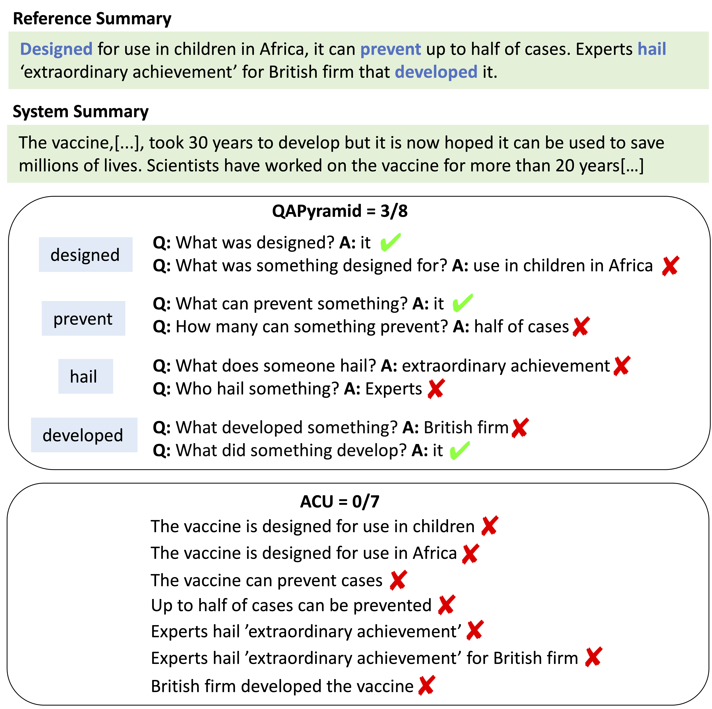

# QAPyramid

This repo contains the data and code for ["QAPyramid: Fine-grained Evaluation of Content Selection
for Text Summarization"]().

## Data

QAPyramid data can be downloaded from Huggingface hub under [`shiyue/QAPyramid`](https://huggingface.co/datasets/shiyue/QAPyramid).
We provide a notebook, [data.ipynb](data.ipynb), for basic usage of our dataset.

[raw_data](./raw_data) contains the raw annotations we collected from Amazon Mechanical Turk. 
It has the annotations from different annotators. 

## Annotation UIs

[htmls](./htmls) contains the annotation UIs we used for data collection. 

## AutoQAPyramid

### Requirement:
- nltk
- openai
- datasets
- [qasem_parser](https://github.com/plroit/qasem_parser)

### Script:
The code for running AutoQAPyramid on our benchmark is provided in `run_autoqapyramid.py`. This script leverages QASem for QA generation and GPT-4o for QA presence detection. The zero-shot variant of the approach is included by default.

The script first loads the dataset and then evaluates it using the AutoQAPyramid metric. The main function, `run()`, accepts the following inputs:

- A list of reference summaries
- A list of system-generated summaries
- An optional list of QAs, where each QA is a tuple in the format (verb, question, answer)

If the QA tuples are not provided, the metric will automatically generate them using QASem. Please pass in `OPENAI_API_KEY={your_api_key}` to run gpt4o.
